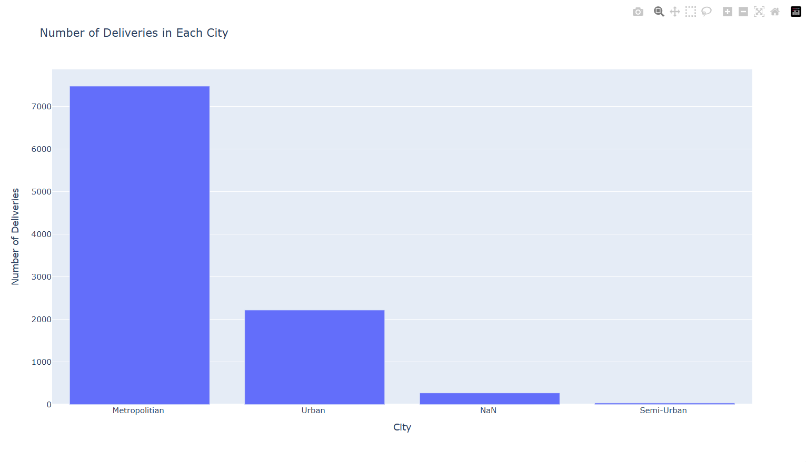

# QA_CSV

## conda env setup

```
conda env create -f environment.yml
```

## run the agent
```
python pandas_dataframe_agent.py
```

## Guardrails Setup

1. Install Guardrails:
```bash
pip install git+https://github.com/guardrails-ai/guardrails.git
```

2. Configure Guardrails:
```bash
guardrails configure
```

3. Get your API key from [Guardrails Hub](https://hub.guardrailsai.com/keys)

4. Install required guards:
```bash
guardrails hub install hub://guardrails/valid_sql --quiet
guardrails hub install hub://tryolabs/restricttotopic --quiet
```

## Sample Questions and Answers

### Dataset Overview
**Q: What data is contained in this dataset?**  
A: The dataset contains 10,000 records related to food delivery, including:
- Delivery person details (ID, age, ratings)
- Location information (restaurant and delivery coordinates)
- Order details (date, time, type)
- Delivery conditions (weather, traffic, vehicle condition)
- City and area information
- Delivery performance metrics

### City-wise Analysis
**Q: How many deliveries were made in each city type?**  
A: The delivery distribution across cities was:
- Metropolitian: 7,479 deliveries
- Urban: 2,218 deliveries
- Semi-Urban: 33 deliveries
- Unspecified: 270 deliveries

### Delivery Time Analysis
**Q: What is the average delivery time for different order types?**  
A: Average delivery times by order type:
- Buffet: 26.27 minutes
- Drinks: 26.31 minutes
- Meal: 26.52 minutes
- Snack: 26.57 minutes

### Weather Impact
**Q: How does weather affect delivery times?**  
A: Average delivery times by weather condition:
- Sunny: 21.91 minutes (fastest)
- Fog: 29.47 minutes (slowest)
- Cloudy: 28.76 minutes
- Stormy: 25.89 minutes
- Windy: 26.35 minutes

### Vehicle Analysis
**Q: How does vehicle condition impact delivery time?**  
A: Average delivery times by vehicle condition:
- Condition 0: 30.19 minutes
- Condition 1: 24.61 minutes
- Condition 2: 24.45 minutes
- Condition 3: 26.58 minutes

### Regional Analysis
**Q: How many deliveries were made in major cities?**  
A: Analysis of major cities shows:
- Coimbatore: 665 deliveries
- Chennai: 652 deliveries

**Q: What is the average number of orders per day in Chennai?**
A: The analysis shows that Chennai handles an average of 15.5 orders per day.

**Q: Which areas have the highest delivery density?**  
A: The areas with the highest delivery density are:
1. Chennai, Tamil Nadu (600001): 153 deliveries
2. Amroli, Surat, Gujarat (394105): 116 deliveries
3. Vadodara, Gujarat (390001): 103 deliveries
4. Vagodhia Taluka, Vadodara: 79 deliveries
5. Ormanjhi, Ranchi: 64 deliveries

### Visualization Examples
**Q: Can you show the distribution of deliveries across cities?**  
This visualization helps illustrate the delivery distribution we saw earlier, with metropolitan areas handling the majority of deliveries.



## Multilingual Support

The agent now supports multiple languages. You can ask questions in any language supported by the `langdetect` library.

**Q:  Nombre de livraisons effectuées regroupées par trafic routier?
A: Le nombre de livraisons effectuées, regroupées par densité de circulation routière, est le suivant :

- Faible : 3 345 livraisons
- Embouteillage : 3 135 livraisons
- Moyenne : 2 398 livraisons
- Élevée : 982 livraisons

De plus, il y a 140 entrées avec des données manquantes pour la densité de circulation routière.

